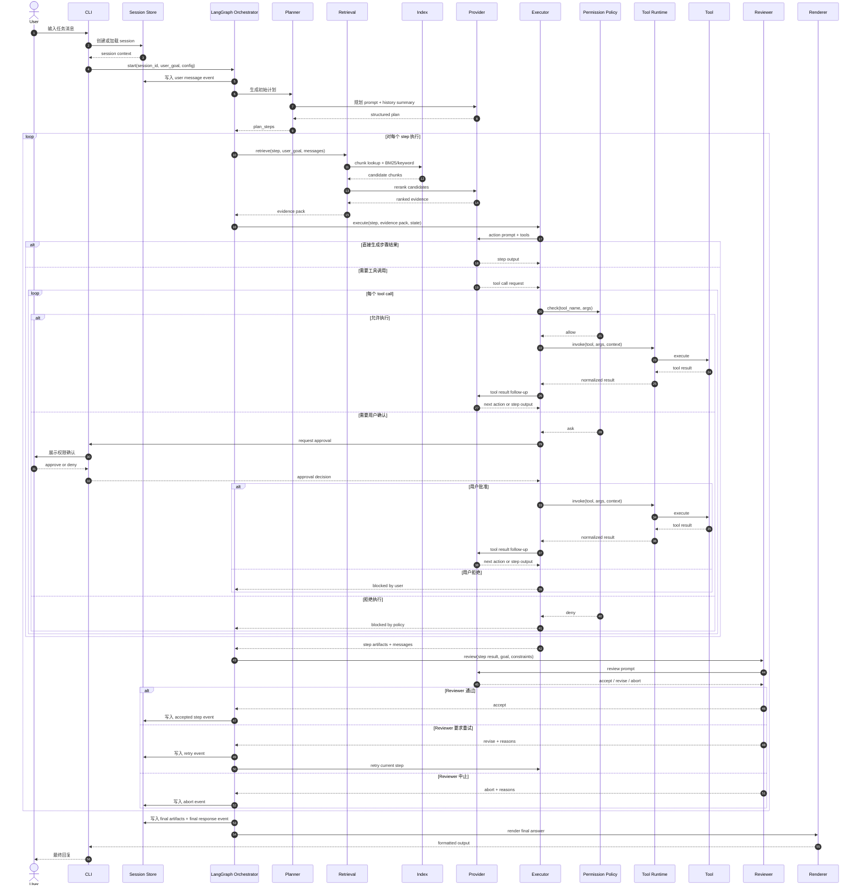

# OpenCode Python 架构设计

## 1. 文档信息
- 日期：2026-03-11
- 状态：Draft v1
- 适用范围：`opencode-python` 项目 MVP
- 关联文档：
  - `docs/plans/2026-03-11-opencode-python-prd.md`

## 2. 设计目标
- 用 Python 构建一个本地单机运行的 CLI coding assistant。
- 用固定三角色 Agent 形成“计划 -> 执行 -> 复核”的任务闭环。
- 在整体上采用 `Plan-and-Execute + Reviewer`，在执行器内部采用 ReAct-style 推理与工具调用循环。
- 把轻量 RAG 作为 MVP 正式子系统，为模型提供可解释的仓库上下文。
- 把工具调用、安全控制、审计和会话恢复纳入统一运行时，而不是散落在 CLI 层。

## 3. 设计约束
- 后端仅使用 Python 实现，不引入 TypeScript 后端或跨语言服务。
- MVP 主编排内核采用 `LangGraph`。
- 检索采用最小可行路线：`文件切片 + 关键词/BM25 召回 + rerank + 来源注入`。
- 持久化以 `SQLite` 为主。
- 模型接口首版只保证 `OpenAI-compatible`。
- `Symbol Graph` 不进入主执行链路，仅作为后续可选增强。

## 4. 总体架构

```text
User
  -> CLI (Typer + Rich)
      -> Session Loader / Config Resolver
      -> LangGraph Orchestrator
          -> Planner Agent
          -> Retrieval Subsystem
          -> Executor Agent
          -> Reviewer Agent
          -> Permission Policy
          -> Tool Runtime
      -> Renderer
      -> SQLite Store
      -> OpenAI-compatible Provider
```

### 4.1 核心分层
- CLI 层：接收输入、加载配置、展示结果、处理权限确认。
- 编排层：负责 graph 节点调度、状态持有、重试、终止和 checkpoint。
- Agent 层：负责计划、执行和审查三个职责。
- 检索层：负责代码发现、分块、召回、rerank 和 evidence pack 组装。
- 工具层：负责统一调用 shell、文件系统和代码搜索。
- 安全层：负责权限判断和审计记录。
- 存储层：负责会话、事件、产物和 checkpoint 落盘。
- Provider 层：负责与模型服务交互，并统一消息和工具 schema。

## 5. 核心组件职责
### 5.1 CLI
- 解析 `chat`、`run`、`session list`、`session show` 命令。
- 根据 CLI 参数、用户配置和环境变量组装运行配置。
- 接收权限确认请求，并把用户的批准或拒绝回传运行时。
- 渲染最终答案、工具摘要和错误信息。

### 5.2 LangGraph Orchestrator
- 持有 `session_id`、用户目标、计划步骤、消息历史、检索结果、产物、决策状态。
- 负责节点流转：`load_context -> retrieve_context -> plan -> execute_step -> review_step -> commit_or_retry -> finalize`。
- 控制单步最大重试次数，避免无限循环。
- 在关键节点写 checkpoint，保证任务中断后可恢复。

### 5.3 Planner Agent
- 基于用户目标、会话摘要和检索结果生成结构化步骤。
- 限制步骤总数，优先短路径计划。
- 为每个步骤提供目标、建议工具和成功判断依据。

### 5.4 Retrieval Subsystem
- 扫描仓库文件并构建轻量索引。
- 以函数、类、文件段落为主做切片。
- 基于关键词和 BM25 做初次召回。
- 使用 rerank 模型或 LLM 对候选片段重排。
- 返回带 `path`、`line_start`、`line_end`、`score` 的 evidence pack。

### 5.5 Executor Agent
- 在当前步骤上下文中调用 Provider 生成动作。
- 采用 ReAct-style loop：`reason -> act -> observe -> continue`。
- 当模型要求工具调用时，协调权限检查和工具运行。
- 把工具结果回填消息历史，驱动同一步骤内的继续推理。

### 5.6 Permission Policy
- 对每次工具调用给出 `allow`、`ask` 或 `deny` 决策。
- 默认模式为 `ask`。
- 对危险 shell 命令、权限提升、网络写入和越权文件写入优先拒绝。

### 5.7 Tool Runtime
- 提供统一的 `invoke(tool_name, args, context)` 协议。
- 负责超时控制、标准输出与错误输出收集、输出截断、异常归一化。
- 首批工具包括 `shell`、`fs_read`、`fs_write`、`search`。

### 5.8 Reviewer Agent
- 基于原始目标、当前步骤目标、工具结果和约束判断是否通过。
- 输出 `accept`、`revise` 或 `abort`。
- 当发现结果不完整、验证失败或风险过高时拒绝通过。

### 5.9 Storage
- 保存 `sessions`、`events`、`artifacts` 和 checkpoint。
- 记录任务生命周期中的关键状态变化和工具审计信息。
- 支持按 `session_id` 查询历史消息和关键信息。

### 5.10 Provider
- 统一封装 OpenAI-compatible 接口。
- 接收规范化消息和工具定义。
- 返回文本、结构化计划或工具调用请求。

## 6. 运行时状态模型
### 6.1 核心状态字段
- `session_id`: 当前会话标识
- `user_goal`: 用户当前任务
- `messages`: 标准化消息列表
- `plan_steps`: 结构化步骤列表
- `current_step`: 当前执行步骤索引
- `retrieval_hits`: 当前步骤检索结果
- `artifacts`: 当前任务累计产物
- `decision`: `continue | retry | done | abort`
- `review_notes`: Reviewer 返回的审查意见
- `trace_id`: 单次任务执行链路标识

### 6.2 状态转移原则
- 所有节点只读写共享状态，不直接跨节点触发副作用。
- 工具执行、会话落盘和权限请求都通过运行时统一出口处理。
- 每个步骤结束后都要产生明确的继续、重试、完成或中止决策。

## 7. 关键流程
### 7.1 正常路径
1. 用户通过 CLI 输入任务。
2. CLI 加载配置和历史会话。
3. Orchestrator 初始化状态并写入用户消息事件。
4. Planner 生成初始步骤计划。
5. Retrieval 为当前步骤构造 evidence pack。
6. Executor 进入 ReAct-style 执行循环，调用 Provider 生成动作。
7. 若需要工具调用，先走权限检查，再由 Tool Runtime 执行。
8. Executor 汇总工具结果并继续当前步骤推理。
9. Reviewer 评估结果是否通过。
10. Orchestrator 决定进入下一步、重试当前步骤或中止。
11. 完成后写入最终事件与产物，由 Renderer 输出结果。

### 7.2 失败路径
- 检索结果为空：允许继续，但要回传“低证据上下文”状态给 Planner 或 Executor。
- 权限拒绝：当前步骤标记为受阻，由 Reviewer 判断是否中止或请求替代方案。
- 工具失败：记录错误输出并反馈给 Executor，决定是否重试。
- Reviewer 拒绝：若有剩余重试次数，按审查意见回到执行节点；否则中止任务。
- Provider 异常：按统一错误类型记录并在安全范围内重试。

## 8. 检索子系统设计
### 8.1 索引策略
- 启动任务时按需扫描仓库。
- 优先跳过明显无关目录，如虚拟环境、构建产物、版本控制目录。
- 以文件路径、语言、切片范围和内容摘要构建轻量索引。

### 8.2 检索链路
1. 根据用户目标、当前步骤和历史上下文构造查询。
2. 使用关键词和 BM25 从切片索引中召回候选片段。
3. 用 rerank 对候选片段重排。
4. 挑选 Top-N 片段组装为 evidence pack。
5. 将 evidence pack 注入 Planner 或 Executor 上下文。

### 8.3 输出格式
- `path`
- `line_start`
- `line_end`
- `snippet`
- `score`
- `reason`

## 9. 工具与安全设计
### 9.1 工具接口
- 输入：`tool_name`、`arguments`、`context`
- 输出：`status`、`stdout`、`stderr`、`artifacts`、`metadata`

### 9.2 权限决策流
- `allow`：直接执行并记录审计。
- `ask`：通过 CLI 请求用户确认，再决定是否执行。
- `deny`：直接阻断并返回明确拒绝原因。

### 9.3 审计要求
- 每次工具调用都记录调用时间、参数摘要、权限结果、执行结果摘要。
- 关键决策包括用户确认、Reviewer 驳回和最终任务状态都应落盘。

## 10. 存储设计
### 10.1 逻辑表
- `sessions(id, title, created_at, updated_at)`
- `events(id, session_id, type, payload_json, created_at)`
- `artifacts(id, session_id, kind, path, metadata_json, created_at)`
- `checkpoints(id, session_id, step, state_json, created_at)`

### 10.2 持久化时机
- 收到用户消息后写入会话与初始事件。
- 每轮步骤完成后写 checkpoint 和关键事件。
- 任务结束前写最终结果、产物和审查结论。

## 11. 模块边界与目录建议

```text
opencode_py/
  cli/
  core/
    graph/
    runtime/
    schemas.py
  agents/
    planner.py
    executor.py
    reviewer.py
  retrieval/
    indexer.py
    ranker.py
    service.py
  tools/
  providers/
  security/
  storage/
  session/
  config/
tests/
```

## 12. 从用户发送消息到最终回复的完整时序图



## 13. 测试策略
### 13.1 单元测试
- 状态转移与终止条件
- 权限决策
- 工具执行结果归一化
- 检索排序和 evidence pack 组装

### 13.2 集成测试
- 单次任务完整 graph 执行
- 工具失败后的重试与中止
- 会话恢复与 checkpoint 回放

### 13.3 E2E 测试
- 从 `chat` 命令输入到最终输出的完整闭环
- 带权限确认的工具执行路径
- 带检索上下文的多步骤任务执行

## 14. 后续演进
- 在轻量 RAG 稳定后评估 embedding 混合检索。
- 在多文件影响分析成为瓶颈后，再评估基于 Python AST 的轻量符号索引。
- 在 LangGraph 主链路稳定后，再考虑更高级的任务模板或编排层。
